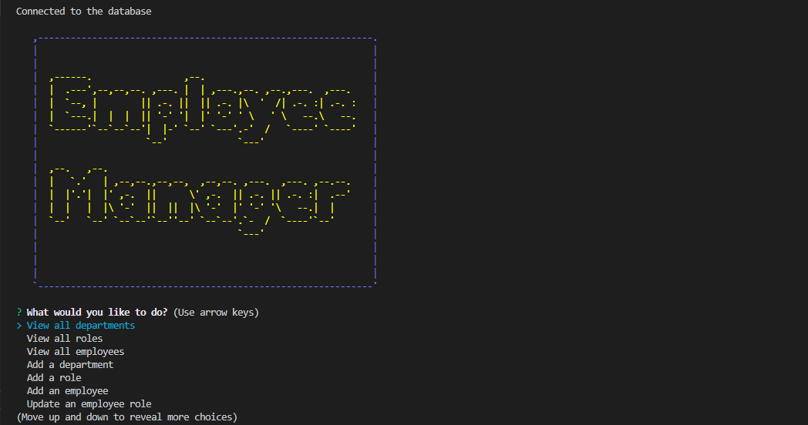

# Employee_Tracker

## Description 

This is the Employee Tracker Repository. Inside this repository you can find an Express, Node.js and mysql based application that allows user to track departments, roles and employees in a company. You can add a department, a role and an employee, also you are able to update the role of an employee. It uses inquirer to retrieve the info from the user, mysql to save data, and npm to connect the code to mysql databases thanks to mysql2 npm dependency. 
There is a db folder which contains sql files which creates the tables inside the database and populates the tables. 

## Usage 

To get started you need to fullfill some requirements. 

1.- Have mysql installed. 
2.- Have nodejs installed. 
3.- Install npm inside the project and all the requirer dependencies (mysql2, inquirer, dotenv).
4.- Run source develop/db/schema.sql; in the mysql shell. 

Once you have done all of this you can type inside the terminal: 

                                npm start 

And the application will start running. Down you can find a walkthrought video to see how the application works. 

https://drive.google.com/file/d/1VPlNTkQMrnBO0fFhipwOOhOLiE4jj5T3/view

## Future Development

For future development, some actions can be implemented, like deleting some items of the tables within the database, or summing the total amount of money a department is spending. 

## Licence

This repository is licenced under the MIT Licence. 